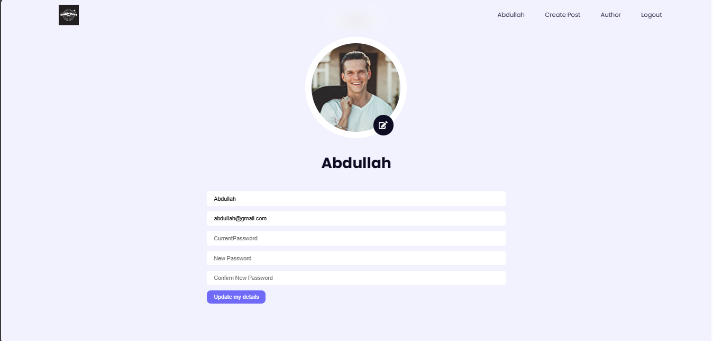
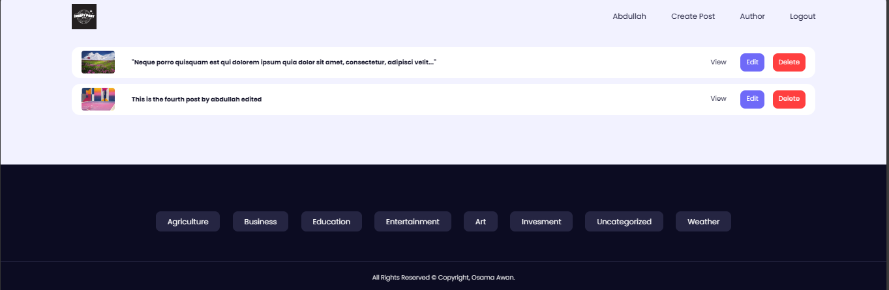
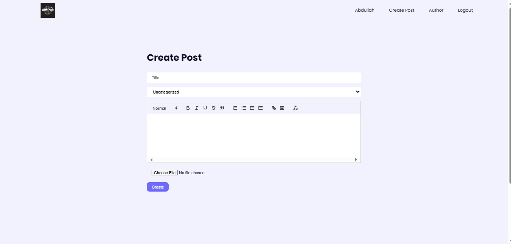
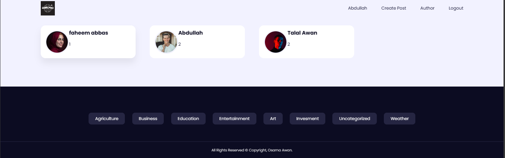
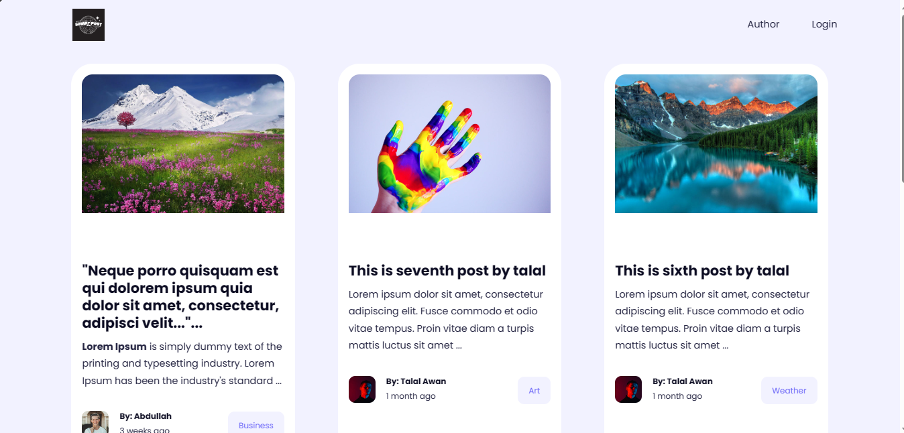

The MERN stack-based Smart Post Hub is a comprehensive web application tailored for secure blog management, offering features for creation, editing, and deletion. With robust user authentication mechanisms in place, each user enjoys a personalized experience with author-specific permissions, ensuring a secure environment for content management.

The platform caters to both registered and non-registered users. While registered users can actively engage in blog creation and editing, non-registered users are provided with read-only access. This approach encourages exploration of the platform's content without allowing unauthorized contributions.

The Smart Post Hub boasts a responsive design, meticulously crafted to deliver an optimal viewing experience across a wide range of devices. Whether accessed from desktops, tablets, or mobile phones, users can seamlessly navigate through the backend and frontend components while appreciating the proficiency in secure user management embedded within the application.

